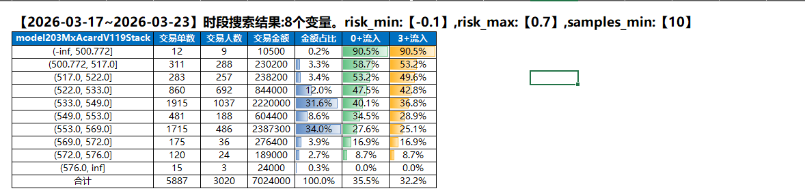
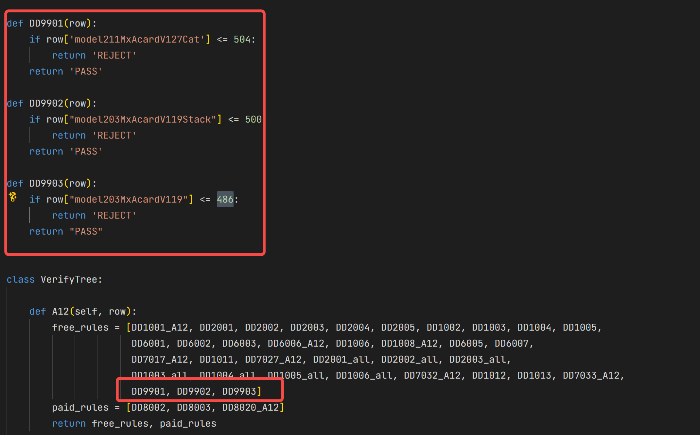

# 一.说明

## 1.环境

python==3.10

## 2.常用指标

- 交易：用户交易前会过批核策略。策略通过才准许交易。批核策略的介入点就在交易前。
- 通过率：通过的用户会交易。通过率=总通过订单/总订单，通过率越高表示流量成本越低。
- 到期： 已交易的用户。如果还款期限是6天。1号交易，7号到期。
- 0+风险：到期日未还金额/到期日总的到期金额。
- 3+风险：到期日(后推3日)未还金额/到期日总的到期金额。 7号到期的订单，10号前还款都不计入到风险中。
- 变量(维度)：若一个用户订单是数据库中的一行，变量就是数据列。有300个变量就表示有300字段(列)。
- 分箱：变量排序后按若干值划分的区间(0,100] (100,200]就是分箱，若变量分箱后能找出高风险的用户，那么分箱端点值即可用来筛选用户。
- 变量排序性: 分箱后按分箱的顺序会呈现风险的单调性，即表示该变量有排序性。
- 变量稳定性：变量在两段时间呈现相似的分布，相似的风险。即为有稳定性。

# 二.目录结构

1. sst/  --------风控函数工具包。计算风险等...  
2. data/  --------历史用户的交易数据
   - trans.pq  --------用户交易数据
   - apply.pq -------用户申贷数据
3. bin_search/  ------    变量分箱搜索
   - auto_bin_1x.py  自动分箱1维函数
   - auto_bin_2x.py  自动分箱2维函数
4. gen_strategy/  ------ 生成策略

# 三. 变量寻找

1. 取指定客群已经到期的订单数据，数据样例在data/trans.pq
2. 指定搜索目标：风险阈值/分箱最新样本数/变量iv值/共线变量剔除/，对应搜索函数的阈值
   ```
   # 这个搜索条件为：风险阈值为0.7，分箱最新样本数为10个
   python 找变量.py
   ```
3. 对客群的数据进行变量搜索，找出最影响客群风险的变量极其变量，输出excel文件。
   
   可以看到搜索的变量都是满足最高的0+流入高于0.7, 每箱最低样本多余10。且0+流入有单调性

# 四.策略生成

## 1. 指定策略目标，这里以收紧策略为例。

```
- 收紧策略：降低风险，尽量少降低通过率。风险降低3%，通过率降低3%。
- 松松策略：提高通过率，尽量少增加风险。通过率提高3%，风险提高3%。
```
制定好目标后，不停进行 风险评估和通过率评估，满足目标就停止评估，说明策略做好了。

## 2. 风险评估

从上一步的变量搜索结果中，挑选达到目标。两段时间稳定，并且分箱单量大的变量。根据分箱的端点值固化为如下策略规则，每个if分支对应一个策略规则。

- 选择不同的变量，每个变量对应一个策略规则。
- 为避免不同的变量抓到的坏人重合，要用瀑布式拒贷进行筛选，将不同变量放在第一拒贷位置，观察该变量拒贷后，其他变量抓到的人是否就不坏了，如果不坏了，就可以减少变量的使用，能抓到更坏更少的人的变量为更好的变量（比如变量1可以抓到20个风险为60%的坏人，变量2能抓到十个风险为80%的坏人，那我们优先选择变量
- 终止条件为pass客群的风险达到目标值。输出内容为下面的代码

```
import pandas as pd
from sst.strategy2.risk import Risk

def get_pb(row):
    if row.model211MxAcardV127Cat <= 504:
        return "00"
    elif row.model203MxAcardV119Stack <= 500:
        return "01"
    elif row.model203MxAcardV119 <= 486:
        return "02"
    else:
        return "PASS"

trans = pd.read_parquet("data/trans.pq")
trans["get_pb"] = trans.apply(lambda x: get_pb(x), axis=1)
# 为每个用户计算了一个 get_pb 值，代表该用户在瀑布式拒贷流程中 被哪个变量命中
risk_df = Risk.get_risk( trans, [ "get_pb"], ["交易单数", "交易人数", "人数占比", "0+流入", "3+流入"])
print("风险变化:", risk_df.loc['PASS','0+流入']- risk_df.loc['合计','0+流入'])
```

## 3. 通过率评估
### 3.1 生成新版策略
- gen_strategy/中的策略为老版策略。复制文件重命名版本+1
- 把风险评估中get_pb中的分支规则按分支写为一条条的规则。写入到新策略中,路由可通过映射得到，这里对应的是A12路由。


### 3.2 评估通过率
评估新旧策略的通过率变化是否满足逾期，满足目标就停止评估。

```
import pandas as pd
from gen_strategy.mx_verify_code_533 import VerifyTree as old_strategy
from gen_strategy.mx_verify_code_534 import VerifyTree as new_strategy

apply = pd.read_parquet("data/apply.pq")
apply['old_pass'] = apply.apply(lambda x: old_strategy().calculate(x)[0], axis=1)
apply['new_pass'] = apply.apply(lambda x: new_strategy().calculate(x)[0], axis=1)

old_pass_rate = (apply['old_pass'] == "PASS").sum() / apply.shape[0]
new_pass_rate = (apply['new_pass'] == "PASS").sum() / apply.shape[0]
print("通过率变化:", new_pass_rate - old_pass_rate)
```